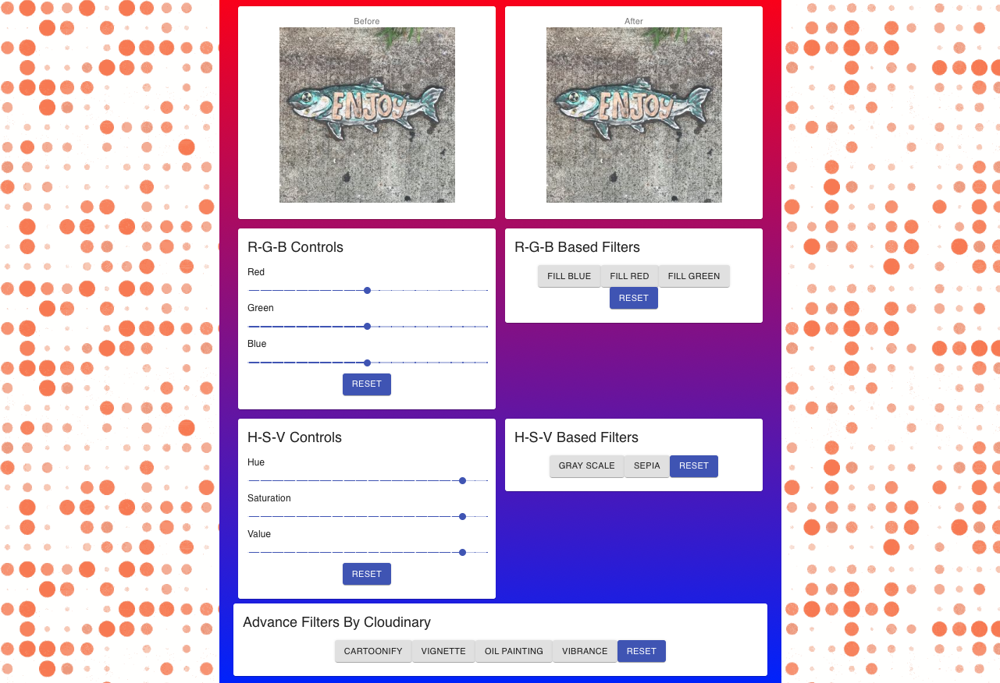

## IMAGERAMA `Updated 12.07.2019` `[VIDEO](https://youtu.be/iU35G4ZFkfM)`

Modern Image processing app with RGB settings, effects and custom filters.

### `Goals of this project`

1. Master React skills and be proficient with Material-UI.
2. Build a fully styled image processing app that ready to use and have a modern UI.
3. Work with Cloudinary API.

### `Tech stack`

1. Front-end is build with React.
2. React components styled with a [Material-UI](https://material-ui.com).
3. [Cloudinary API](https://cloudinary.com/documentation/admin_api) for image processing.

